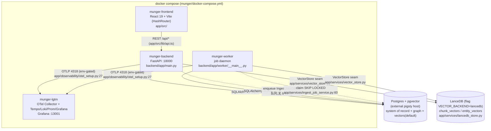
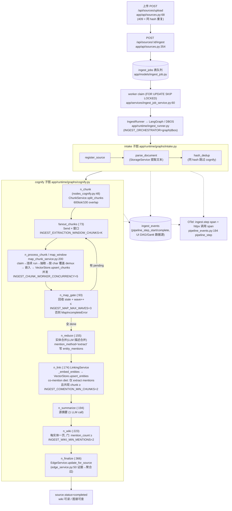
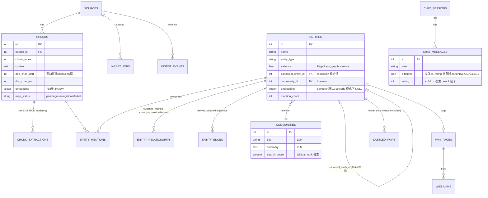
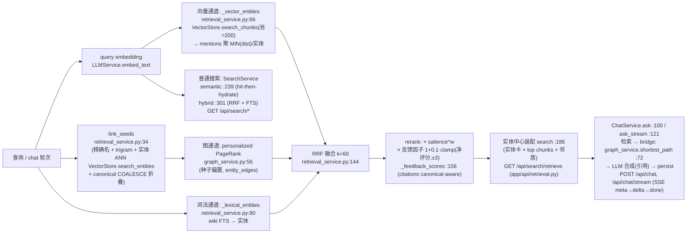
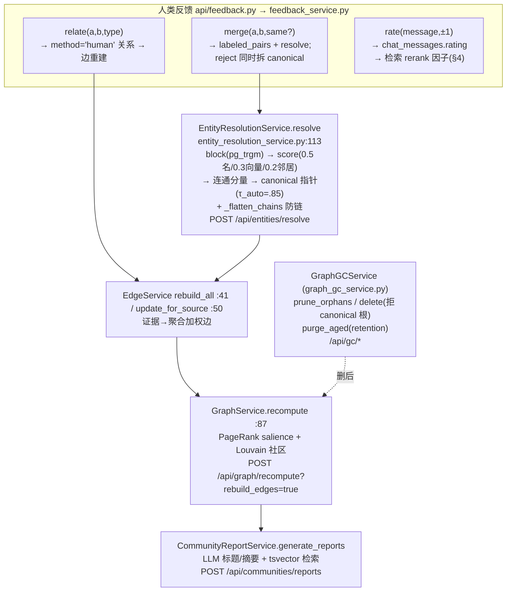
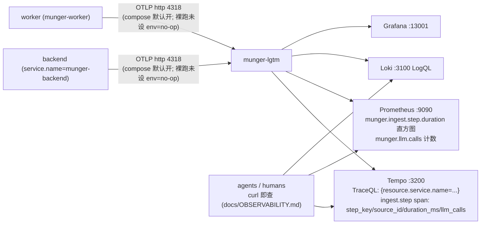

# Munger — As-Built Architecture Diagrams

> **现状文档**(as-built, main @ 2026-06-12, PR #31)。北极星/目标态见
> `docs/superpowers/specs/2026-06-09-munger-data-architecture-design.md`;两者的差异
> 只剩:SP5(Pathway/Ray,10M 规模触发)未建、向量默认仍在 pgvector(LanceDB 在
> `VECTOR_BACKEND` 开关后)。行号为写作时锚点,漂移时按函数名 grep。

---

## 1. 系统架构(容器 / 运行时 / 存储 / 观测)

| 组件 | 关键代码 |
|---|---|
| FastAPI 装配(CORS→OTel→routers) | `backend/app/main.py`(module-scope `setup_otel`) |
| Worker 守护(claim 循环 + DBOS launch) | `backend/app/worker/runner.py`, `app/worker/__main__.py` |
| LLM 多 provider + 时长护栏 | `app/services/llm_service.py`(`LLMService.chat:639`,总预算 `_bounded`;structured 见 §2 护栏) |
| 配置(全部 env knobs) | `app/core/config.py`(`Settings`) |
| 观测装配(traces/metrics/logs,env 未设=零开销) | `app/observability/otel_setup.py:27 setup_otel` |

---

## 2. Ingestion Pipeline 全流程

**抽取调用护栏链**(2026-06-12 实测后加固,`llm_service.py`):
`chat_structured` → instructor(transport timeout = `LLM_STRUCTURED_TIMEOUT_S=60`/attempt,总顶 2×)→ 确定性 4xx 立即中止(`_non_retryable_status`,403 不再烧 6 连重试)→ fallback chat 受 `LLM_CALL_TIMEOUT_S=120` 总时长顶(httpx 超时只管字节间隔,滴流响应靠它兜)。抽取 prompt 带输出预算(`extraction_service.py:22 EXTRACT_SYSTEM`:描述 ≤20 词、≤25 实体/chunk)。

---

## 3. 数据模型(现状 ER)

| 层(北极星 least-viable-state) | 表 | 模型文件 |
|---|---|---|
| 原始证据(不可重算) | `chunk_extractions`, `entity_mentions`, `entity_relationships` | `app/models/chunk_extraction.py`, `entity.py`, `entity_relationship.py` |
| 身份 | `entities` | `app/models/entity.py` |
| 人类真值(神圣) | `labeled_pairs`, `chat_messages.rating` | `app/models/labeled_pair.py`, `chat_message.py` |
| 派生(可重建) | `entity_edges`, `communities`, `wiki_pages/links`, salience/community_id/embedding | `entity_edge.py`, `community.py`, `wiki.py` |
| 运维 | `ingest_jobs`, `ingest_events`, `configs` | `ingest_job.py`, `ingest_event.py`, `config.py` |
| 向量 | pgvector 列(默认)或 LanceDB `chunk_vectors`/`entity_vectors` | seam: `app/services/vector_store.py`;迁移: `scripts/migrate_vectors.py` |

Retention(默认关):`POST /api/gc/retention` → `graph_gc_service.purge_aged()` 按
`RETENTION_INGEST_EVENTS_DAYS` / `RETENTION_CHUNK_EXTRACTIONS_DAYS` 老化(后者是证据层,删=放弃重聚合,文档已警示)。

---

## 4. 读路径(search / 检索漏斗 / chat)

---

## 5. 写回 / 自改进路径(ingest 之外)

---

## 6. 观测流(SP6)

埋点缝:`app/runtime/pipeline_events.py:194 pipeline_step`(一个 contextmanager 盖全部 11 步 + 两条执行路径);httpx 自动埋点让每次 LLM HTTP 调用免费成 span。`ingest_events` 与 LangSmith 不被替代(分别服务产品 UI 与 LLM 语义轨迹)。

---

## 运行红线(本仓铁律)

- **任何东西不允许长时运行**:调用级 `LLM_CALL_TIMEOUT_S=120` / structured 2×60s 总时长顶;运维 watchdog 语义 = 60s 无进展即杀;live bench 已退役(成本/延迟真相 = 本页 §6 的 OTel)。
- compose 只从主 checkout 跑(worktree 无 `.env`)。
- 迁移 migration-only;新行为 flag 默认关(additive)。
- 测试:venv 3.12 + `munger_test`(命令见 `docs/superpowers/STATUS.md`)。
