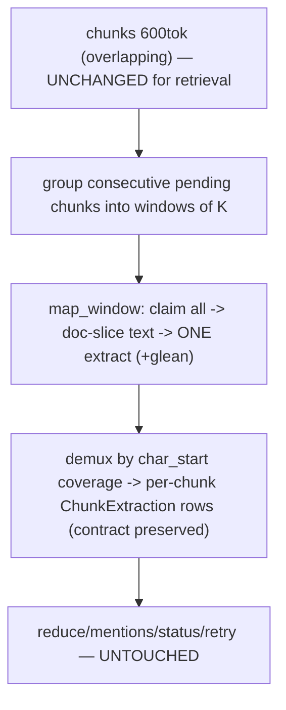

# Extraction-Window Decoupling Implementation Plan

> **For agentic workers:** REQUIRED SUB-SKILL: Use superpowers:subagent-driven-development. Steps use checkbox syntax.

**Goal:** Decouple **extraction granularity** from **retrieval granularity**: entity extraction runs over windows of K consecutive chunks (ONE LLM call per window, default K=1 = exactly today's behavior), while chunks stay 600 tok for embedding/retrieval/mention provenance. Fixes the fragmentation tax (273 entities & up to 68 LLM calls per 12-page paper) without touching the retrieval layer.

**Architecture:** All map execution already funnels through `MapChunkService.map_single_chunk` (the Send-mode node delegates per chunk; service mode gathers the same call). Add `map_window(chunk_ids, ...)`: claim all window chunks → build the window text as a **doc slice** `source.content_text[first.doc_char_start : last.doc_char_end]` (overlap appears once, unlike concatenating chunk contents) → one extract (+ optional glean) call with offset base = window start → offsets become doc-global → **demux** extracted entities into per-chunk `ChunkExtraction` rows by which chunk's `[doc_char_start, doc_char_end)` contains `char_start` (first containing chunk wins; offset-less entities + all relationships go to the window's first chunk) → mark all window chunks done/failed together. Downstream (reduce, mentions, statuses, retry waves) is untouched because the per-chunk extraction-row contract is preserved. `map_single_chunk` becomes a `map_window([id])` wrapper. Fan-out groups chunks into windows in both modes. New setting `INGEST_EXTRACTION_WINDOW_CHUNKS` (default **1** → zero behavior change; recommend 2–3).

**Tech Stack:** Python 3.12, existing MapChunkService/LangGraph Send machinery, pytest + ScriptedLLMService. No migration.

---

## Ground truth (verified — do not re-derive)

- Chunks: doc-relative `doc_char_start/doc_char_end` computed via `len(enc.decode(tokens[:k]))`; consecutive chunks OVERLAP (100 tok), so chunk N's end > chunk N+1's start. `split_chunks` writes `map_status="pending"`.
- Map paths: Send mode `fanout_chunks` → one `Send("n_process_chunk", {chunk_id})` per chunk → node calls `services.map_chunks.map_single_chunk`; service mode `map_chunks` gathers `map_single_chunk` per chunk under a semaphore. **Single implementation point.**
- `_extract_chunk` sends `chunk.content` with `Document offset base: {chunk.doc_char_start}`; LLM returns chunk-relative `char_start/char_end`; code adds the base → **doc-global** before storing in `ChunkExtraction.entities` (JSON). `_glean_loop` = one extra round (`glean_round=1`), same offset handling.
- `ChunkExtraction`: `(chunk_id, glean_round)` unique; columns chunk_id, source_id, entities JSON, relationships JSON, glean_round.
- Reduce: joins ChunkExtraction×Chunk by source, creates `EntityMention(chunk_id=extraction's chunk, char_start/end=doc-global, context=source.content_text[start:end] or chunk.content[:200])`. **Untouched by this plan.**
- Statuses: `claim_chunk_for_map` (CAS pending|failed→running), `MAP_DONE` on success, `mark_chunk_failed` on exception; `all_chunks_done` gates reduce; retry waves re-fan NEEDS_MAP chunks (pending|failed) up to 3 waves.
- Settings (config.py ~54-91): chunk 600/100, `ingest_max_gleanings=1`, `ingest_map_mode="send"`, no window setting. Baseline **167 passed, 4 deselected**.

## File structure
- **Modify** `app/core/config.py` (one field), `app/services/map_chunk_service.py` (core), `app/runtime/graphs/nodes/nodes_cognify.py` (fanout grouping), `app/runtime/graphs/nodes/chunk_map.py` (node accepts chunk_ids), `munger/.env.example` (document the knob).
- **Tests:** `tests/integration/test_extraction_windows.py` (new); existing map/E2E tests must stay green (K=1 default).

## Architecture diagram



---

### Task 1: `map_window` core + setting + service-mode grouping

**Files:** `app/core/config.py`, `app/services/map_chunk_service.py`; Test `tests/integration/test_extraction_windows.py`.

- [ ] Add setting after `ingest_chunk_worker_concurrency`:
```python
    ingest_extraction_window_chunks: int = Field(default=1, alias="INGEST_EXTRACTION_WINDOW_CHUNKS")
```
- [ ] `MapChunkService`: add `map_window(self, chunk_ids: list[int], source_id: int, job_id: int | None = None) -> dict`:
  1. Load the chunks (ordered by chunk_index); claim EACH via the existing CAS claim (skip ones that fail the claim — another worker owns them; if none claimed, return `{"skipped": len(chunk_ids)}`).
  2. Load `source.content_text`; window text = `content_text[chunks[0].doc_char_start : chunks[-1].doc_char_end]`; offset base = `chunks[0].doc_char_start`. (Doc slice → the 100-tok overlaps appear once.)
  3. Run the existing extract prompt with that text + base (reuse `_extract_chunk`'s message shape; offsets += base → doc-global). Same for the glean loop (window-level, `glean_round=1`).
  4. **Demux** per round: for each entity, owning chunk = FIRST claimed chunk whose `doc_char_start <= char_start < doc_char_end`; `char_start is None` or out-of-range → first claimed chunk. ALL relationships → first claimed chunk. Write one `ChunkExtraction(chunk_id=…, source_id, entities=…, relationships=…, glean_round=r)` per chunk that has content for round r (respect the `(chunk_id, glean_round)` unique — delete-then-insert or upsert consistent with current single-chunk behavior).
  5. Success → all claimed chunks `MAP_DONE`; exception → all claimed chunks `mark_chunk_failed`, re-raise/return error metrics like today.
- [ ] `map_single_chunk(chunk_id, …)` → thin wrapper: `return await self.map_window([chunk_id], source_id, job_id=job_id)` (preserve its return-shape keys used by callers/metrics; adapt as needed so existing tests pass UNCHANGED).
- [ ] Service mode `map_chunks`: group the pending-chunk list into runs of K consecutive `chunk_index` (`K = settings.ingest_extraction_window_chunks`; non-consecutive indexes break a window), `_worker` takes a window.
- [ ] Tests (ScriptedLLMService; build chunks via `ChunkService.split_chunks` on crafted text so doc offsets are real):
  - `test_window_demux_attributes_entities_to_owning_chunks` — K=2-ish window over 3 chunks; scripted extraction returns entities whose window-relative offsets land in chunk 0 and chunk 2 → ChunkExtraction rows exist for BOTH with doc-global offsets inside each chunk's range; relationships on the first chunk's row.
  - `test_window_of_one_equals_legacy` — `map_single_chunk` on one chunk produces one row, status done (legacy contract).
  - `test_window_failure_marks_all_failed` — LLM raises → all window chunks `failed`.
  - `test_offsetless_entities_fall_to_first_chunk`.
- [ ] Full suite green (default K=1 → existing map/E2E tests untouched). Commit.

### Task 2: Send-mode fan-out grouping + env example

**Files:** `app/runtime/graphs/nodes/nodes_cognify.py` (`fanout_chunks` + the retry-wave router), `app/runtime/graphs/nodes/chunk_map.py` (`process_chunk` accepts `chunk_ids`), `munger/.env.example`.

- [ ] `fanout_chunks`: group `chunk_ids` (they're ordered) into windows of K → `Send("n_process_chunk", {"source_id", "job_id", "chunk_ids": [...]})`. Retry-wave router: same grouping over the re-fan list.
- [ ] `process_chunk`: accept `chunk_ids` (list) with back-compat for `chunk_id` (single) → call `map_window` / wrapper; metrics keyed by joined ids.
- [ ] `.env.example`: document `INGEST_EXTRACTION_WINDOW_CHUNKS` (default 1; recommend 2-3 for dense papers — halves/thirds map LLM calls and reduces entity fragmentation).
- [ ] Test: `test_send_fanout_groups_windows` — call `fanout_chunks` directly with a state of 5 chunk_ids + K=2 settings (monkeypatch settings or construct) → 3 Sends with [2,2,1] grouping; payload carries `chunk_ids`.
- [ ] Full suite green. Commit.

### Task 3: Review + regression + ship

- [ ] Reviewer pass (focus: demux boundary cases — overlap region assignment determinism, out-of-range offsets, claim-race when only part of a window claims, unique-constraint collisions on re-runs/waves, K=1 behavioral identity).
- [ ] Full suite; STATUS + memory; PR; **auto-merge** (user-authorized); fetch main.

## Self-Review
**Coverage:** window text = doc slice ✓ (overlap deduped); one LLM call per window ✓; demux preserves per-chunk extraction contract ✓ (reduce/mentions/status untouched); both fan-out modes ✓; default K=1 = zero change ✓; opt-in knob documented ✓. **Placeholders:** Task 1/2 specify behavior + tests concretely; exact code authored by implementers against quoted ground truth (offsets/claims/statuses all pinned above). **Risks pinned for review:** partial-claim windows, unique-constraint on retries, overlap-region ownership.
