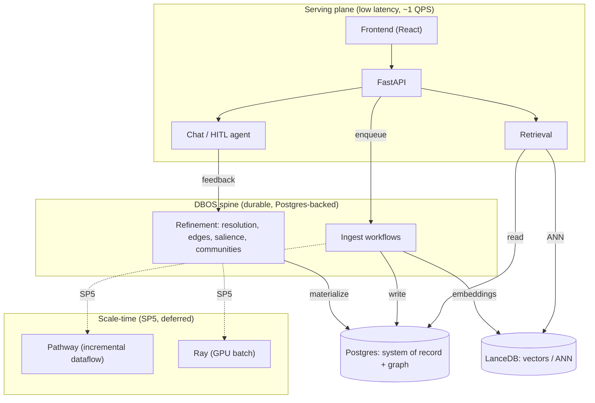
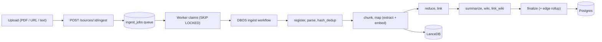
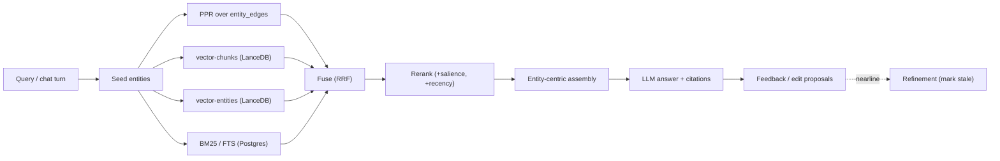
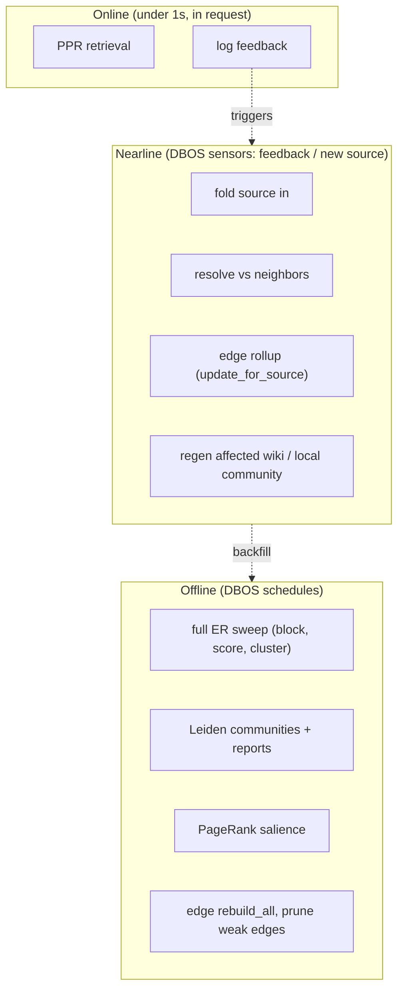
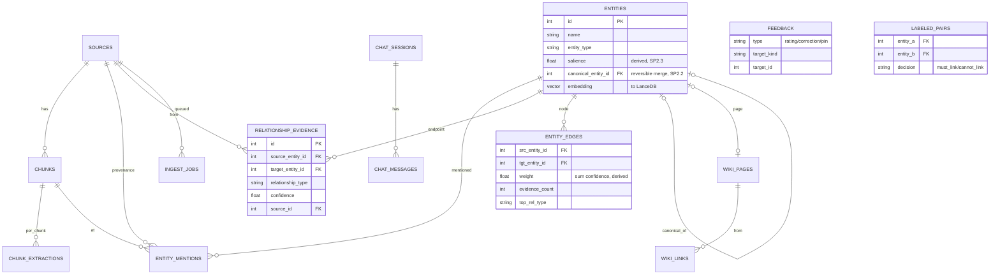

# Munger Data Architecture — North-Star Design

**Status:** Approved (brainstorming complete, 2026-06-09)
**Scope:** Re-architecture of Munger's ingest + retrieval + self-improvement + chat into a coherent, observable, evolvable data system. Replaces the current LangGraph ingest pipeline.

---

## 1. Vision

Munger decomposes information into **entities** bound to **source documents**, then lets the user *retrieve*, *converse*, and *grind on topics* — finding cross-domain connections ("compound interest" of patterns). Two end-goals beyond today's one-shot ingest→search:

1. **Self-improving knowledge base** — the graph refines itself (dedup, enrich, add/prune references) as more evidence and feedback arrive.
2. **Interactive talk-with-it database** — a conservative read-write chat agent that retrieves existing knowledge, ingests new knowledge mid-conversation, and improves the graph from user feedback.

The project is named for Charlie Munger's *latticework of mental models* — so **cross-domain bridging is the core feature, not an add-on.**

## 2. Constraints & calibration

- **Single user, personal use.** No multi-tenancy. Serving concurrency ≈ 1 QPS.
- **Scale is in the data, not the serving.** Target ~10M+ chunks. The challenge is storage size, index build, and **embedding/ingest throughput** — *not* query concurrency.
- **Prefer libraries over servers.** For one user, a stack of libraries on existing Postgres beats a platform of clustered servers.
- **Borrow rec-sys patterns, not rec-sys infrastructure.** Candidate-generation → ranking → feedback loop, and the offline/nearline/online compute split — applied at personal scale.

## 3. The mistake we corrected

Initial design put one orchestrator (Dagster) over everything. **Dagster orchestrates batch; it does not process, does not stream, and cannot host HITL agent sessions.** The corrected design uses **four runtimes**, each matched to its workload, and demotes orchestration to a library.

## 4. Four runtimes

| Runtime | Workload | Tool | Notes |
|---------|----------|------|-------|
| **R1 Serving** | retrieval + chat HTTP, low latency, stateless reads | **FastAPI** | unchanged; no orchestrator in hot path |
| **R2 HITL agent sessions + orchestration** | durable ingest workflows, chat reasoning that pauses for human input, scheduled batch | **DBOS** (MIT library, Postgres-backed) | the spine; replaces LangGraph's orchestration role |
| **R3 Incremental** | keep live indexes + graph-edge views fresh as data lands, no full rebuild | **Pathway** (differential dataflow) — *deferred to SP5* | scale-time; MVP uses DBOS process-the-delta workflows instead |
| **R4 Heavy batch** | mass embed/extract at 10M, full ER sweep, Leiden, PageRank | **Ray Data + vLLM** / TEI — *deferred to SP5* | scheduled by R2; MVP uses in-process batch steps |

**Division of labor (critical):** DBOS *orchestrates*; the actual processing lives in **plain Python step functions** DBOS runs durably (same way Dagster wouldn't have processed). DBOS queues provide concurrency + LLM rate-limiting (replacing today's global semaphore). Pathway and Ray are **scale-time additions**, not MVP requirements.

### Who owns each processing step

| Step | MVP owner | Scale owner |
|------|-----------|-------------|
| Document processing (parse PDF/URL/docx, OCR) | DBOS step | DBOS step (+Ray OCR batch) |
| Chunking | DBOS step | DBOS step / Pathway |
| LLM + embedding calls | DBOS step → LLM API / local TEI, rate-limited via DBOS queue | Ray Data+vLLM (bulk), Pathway (incremental) |
| Ingestion pipeline | **DBOS workflow** | DBOS workflow |
| Entity generation (extract + resolve) | DBOS steps (extract=LLM, resolve=block→score→cluster) | extract→Ray, resolve incremental→Pathway, sweep→batch |
| Graph building (edges, PageRank, communities) | DBOS steps (igraph) | edges→Pathway, PageRank/Leiden→batch |

## 4a. Diagrams

### Architecture

### Write path — ingest

### Read path — retrieval + chat

### Background tasks — compute tiers

## 5. Storage & data model

### Stores

- **Postgres = system of record** — sources, chunks (metadata + content), evidence tables, entities, wiki, feedback, chat, DBOS workflow state.
- **LanceDB = vectors** — embedded, disk-based, versioned; `chunk_vectors`, `entity_vectors` keyed by Postgres ids. No server.
- **Graph stays in Postgres** (recursive CTE, bounded fan-out). Escape hatch: KuzuDB if deep multi-hop becomes core.

### Least-viable (durable) state — store only the irreducible

| Layer | Tables | Why durable |
|-------|--------|-------------|
| Raw evidence | `chunk_extractions` (raw LLM JSON), `entity_mentions(entity_id, chunk_id, span, method)`, `relationship_evidence(src, tgt, rel_type, chunk_id, method)` — **one row per observation, not aggregated** | non-deterministic + expensive to recompute; can re-aggregate, never disaggregate |
| Identity | `entities(id, name, type)` | stable id anchors FKs |
| Human truth | `labeled_pairs(a, b, decision=must_link\|cannot_link, by, at)`, `feedback(...)` | sacred — never recompute |
| Workspaces | `chat_sessions`, `chat_messages` | the user's conversations |

Everything else (`weight`, `confidence`, `salience`, `description`, `embedding`, `canonical_entity_id`, `community_id`, aggregated edges, wiki pages) is **derived** — droppable and rebuildable.

### Pre-computed (derived) serving state — ranked by read-acceleration

| Precompute | Built from | Accelerates | Tier |
|-----------|-----------|-------------|------|
| `entity_edges` (aggregated, weighted) | `relationship_evidence` | all graph reads | offline+nearline |
| `entity_top_neighbors` (top-K by weight) | `entity_edges` | graph expansion + PPR seeds; kills super-hub fan-out | offline |
| `entity_salience` (PageRank prior) | `entity_edges` | ranking feature | offline |
| chunk + entity vectors / ANN (LanceDB) | chunks, entities | semantic recall + ER blocking | per-source + offline |
| `entity` enriched cache (desc, count, community) | mentions, edges | avoids per-read aggregation/LLM | nearline |
| `communities` + `community_reports` | `entity_edges` (Leiden) + LLM | global search / cluster view | offline |
| `entity_top_chunks` | mentions + vectors | assembly w/o query-time ranking | nearline |
| `bridge_candidates` (structural holes) | communities + edges | conservative cross-domain proposals | offline |
| FTS index (`search_vector`) | chunks/wiki | lexical recall channel | per-source |

**Discipline:** the serving plane reads precomputed tables, never aggregates evidence at query time. This is why corpus size stops mattering at query time.

### Schema deltas from today

- `chunks.embedding` removed → LanceDB; keep `embedding_model`, `embedded_at`.
- `entities.embedding` → LanceDB; add `salience FLOAT`, `canonical_entity_id` (self-FK, nullable) for **reversible** merges.
- Split `entity_relationships` into **`relationship_evidence`** (durable, per-observation) + derived **`entity_edges`** (aggregated, weighted).
- New: `feedback`, `labeled_pairs`, `chat_sessions`, `chat_messages`.
- Partition the giant tables (`entity_mentions`, `chunk_extractions`) by source_id/time at scale.
- `ingest_jobs`/`ingest_events` shrink — DBOS owns run/retry/timeline state.

### Core data model (diagram)

Target model. `RELATIONSHIP_EVIDENCE` is the current `entity_relationships` (evidence layer); `ENTITY_EDGES` is the derived weighted adjacency (SP2.1); `FEEDBACK` / `LABELED_PAIRS` / `CHAT_*` are planned (SP2.2/SP4). Vectors move to LanceDB.

## 6. Retrieval (serving plane)

Rec-sys funnel applied to the KB:

1. **Multi-channel recall** (parallel): vector-chunks (LanceDB) ∥ vector-entities ∥ BM25/FTS (Postgres) ∥ **graph-expansion via Personalized PageRank** (HippoRAG-style, seeded from query-matched entities over `entity_edges`).
2. **Rank / fuse**: RRF → cross-encoder/LLM rerank, with features: semantic, lexical, graph-centrality (`salience`), recency, co-mention.
3. **Entity-centric assembly**: return matched entities + best chunks + graph neighborhood + community context — *not* raw chunks.
4. **Query modes** (GraphRAG): **local** ("tell me about X") and **global** ("what connects econ and ML?", map-reduce over `community_reports`).

## 7. Chat + self-improvement loop

**Conservative read-write agent** (locked decision: proposes graph edits only when asked or high-confidence). Two superpowers: *cluster knowledge* (communities) and *link domains* (bridges across communities = structural holes = "compound interest").

Per turn: retrieve → answer with citations → **propose** graph edits (links/merges) → user confirms/rejects/corrects → conversation ingested as an episode → feedback rows written → DBOS sensor marks affected derived state stale → rematerialize.

**Three compute tiers** (Netflix offline/nearline/online):

| Tier | Budget | Trigger | Work |
|------|--------|---------|------|
| Online | <1s | query/turn | PPR retrieval, link just-mentioned entities, log feedback |
| Nearline | secs–mins | feedback / new source | fold one source in, resolve vs neighbors, regen affected wiki, update local community |
| Offline | mins–hrs | schedule | full ER sweep, global Leiden, PageRank, edge pruning |

**Entity resolution** (block → score → cluster): blocking via LanceDB ANN, scoring via embedding+name+shared-neighbors+LLM, clustering → `canonical_entity_id`. **Incremental** (Graphiti-style, resolve-vs-existing without full recompute) at nearline; **full sweep** at offline. **Human-in-the-loop:** user confirmations become must-link/cannot-link constraints + scorer training data.

## 8. Frontend

**Parallelization mechanism: freeze the API contract first** (Pydantic → OpenAPI → TS types). FE builds against **MSW** mocks; BE implements the same contract. Each sub-project ships its contract as deliverable #1. shadcn/ui components; FE can scaffold all panels with mock data immediately.

Panels (new in bold): Ingest (enhanced) · Wiki list+reader (**pagination + community sort**) · **Entity page** · **Graph explorer** (Cytoscape/Sigma/react-flow) · Search · **Chat / grind workspace** (proposal cards) · **Review queue** (HITL ER) · **Ops/health** (BIG TABLE dashboard).

## 9. Testing harness — the BIG TABLE

A registry (YAML or DB table) of checks: `id | stage/asset | kind(constraint|metric|eval) | assert | threshold | severity | owner(agent|human) | last_result`. Three executors:

- **(A) Data/graph invariants → DBOS scheduled check-workflows** (we own these since DBOS Conductor UI is paid). E.g. every chunk has an embedding; no orphan `canonical_entity_id`; mention_count matches evidence; anomaly checks vs recent history.
- **(B) LLM/RAG quality → eval harness.** Golden datasets + metrics: extraction P/R, retrieval recall@k/MRR/nDCG, ER pairwise F1 vs `labeled_pairs`, answer faithfulness/context-precision (**Ragas**), LLM-as-judge. Runners: **DeepEval** (pytest CI gates) + **LangSmith** (already wired). Synthetic test generation for scale.
- **(C) Services + perf → pytest + SLO metrics** via OpenTelemetry (ingest throughput, retrieval-stage latency, embedding rate).

**Alerting:** DBOS check-workflow failure → structured payload → (to user) Slack/email; (to agents) webhook that spawns a Claude Code agent to triage/fix, or opens a GitHub issue. Observability = OTel traces (DBOS native) + SQL on workflow tables; optional Arize Phoenix/Grafana backend.

## 10. References

**Ideas:** Amatriain *Blueprints for recommender architectures* (offline/nearline/online); Covington 2016 *YouTube DNN recs* (funnel); Burt *Structural Holes*; Munger *Poor Charlie's Almanack*.
**KG+RAG:** Edge 2024 *GraphRAG: Local to Global*; Gutiérrez *HippoRAG / HippoRAG 2* (arXiv 2502.14802, PPR); *Zep/Graphiti* (arXiv 2501.13956, incremental temporal KG); RAPTOR, LightRAG.
**Entity resolution:** Papadakis 2020 *blocking/filtering survey*; Christophides *End-to-End ER survey*; Dong 2014 *Knowledge Vault*; Databricks ER accelerators.
**Algorithms:** Traag 2019 *Leiden*; Haveliwala 2002 *Personalized PageRank*; Cormack 2009 *RRF*.
**Infra:** DBOS docs (Postgres-backed durable execution, MIT); LanceDB; Pathway (differential dataflow, BSL); Ray Data+vLLM; HF Text-Embeddings-Inference; pgvector/ParadeDB.
**Eval:** Ragas, DeepEval, promptfoo, LangSmith.

## 11. MVP + decomposition

**MVP = thinnest vertical slice through all planes, on the current corpus (not 10M).** Proves the value hypothesis (graph-aware retrieval + conservative bridging + feedback-improves-graph) before scale-hardening. MVP stack: **DBOS + worker step code + Postgres + LanceDB. No Pathway, no Ray.**

| # | Sub-project | Delivers | Depends on |
|---|-------------|----------|-----------|
| **SP0** | Test/eval/observability harness (BIG TABLE, checks, OTel, alerting) — built alongside SP1 | foundation every later SP plugs into | — |
| **SP1** | **Spine swap**: DBOS orchestrator path behind `INGEST_ORCHESTRATOR` flag; migrate ingest steps to durable workflow; vectors → LanceDB; schema deltas | same behavior as today on the new spine (parity-tested) | — |
| **SP2** | Global asset layer: ER (block→score→cluster), `entity_edges`+weights, Leiden communities + reports, salience, serving tables | rich clustered graph; offline tier | SP1 |
| **SP3** | Retrieval serving plane: multi-channel recall (PPR+vector+BM25+graph) → rerank → entity-centric assembly | much better retrieval; upgrades wiki/search UI | SP2 |
| **SP4** | Chat + feedback loop: conservative agent, bridge proposals, feedback→nearline, HITL ER | the talk-with-it + self-improving vision | SP3, SP2 |
| **SP5** | Incrementality + scale: Pathway (differential dataflow), Ray (GPU batch), partitioning, escape hatches | fast fold-in, 10M-scale | SP4 |

**Sequencing principle:** riskiest infra first (SP1 keystone) with the current pipeline as parity oracle; the chat payoff (SP4) last but reachable. Each SP gets its own implementation plan.

## 12. Open risks

- Pathway is BSL-licensed (accepted for personal use) and younger; deferred to SP5 so it's never load-bearing for MVP.
- DBOS Conductor (ops UI) is paid → we build the BIG TABLE harness ourselves (SP0); runtime is MIT + Postgres-only.
- 10M embedding throughput unproven until SP5 (Ray/TEI); MVP runs at current corpus size.
- Reversible resolution (`canonical_entity_id`) adds query indirection — measure before optimizing.
