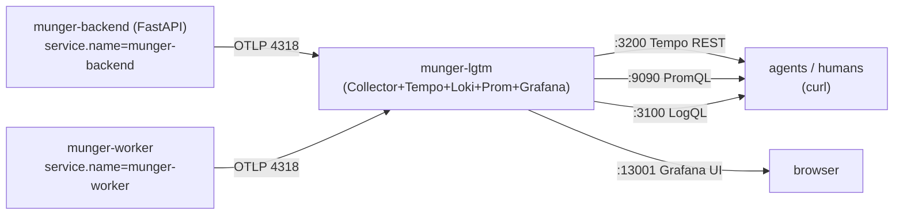

# SP6 — OTel Stack Design (Unified Traces / Metrics / Logs)

**Date:** 2026-06-12 · **Status:** approved (brainstormed)
**Motivation:** Long pipeline runs (job-4 incident: aborted after 30+ min of babysitting) are unobservable without a human polling. Agents and humans should answer "where did this run spend time / how many LLM calls / where is it stuck / what errored" with **plain REST calls** against a standing observability stack.

## Decisions (locked)

1. **Backend = `grafana/otel-lgtm` all-in-one container** — OTel Collector + Tempo (traces) + Loki (logs) + Prometheus (metrics) + Grafana (UI) in ONE compose service. Rejected: Jaeger-only (no logs/metrics), five-service self-assembly (maintenance tax, single-user overkill).
2. **Agent query surface = native REST direct-query** (no custom /api/obs facade). Tempo/Loki/Prometheus query APIs are mature and unbounded; recipes documented. A facade can be added later if query patterns ossify.
3. **Default-on in compose, default-off elsewhere** — compose presets `OTEL_EXPORTER_OTLP_ENDPOINT` on backend+worker so the containerized stack always reports; bare `uvicorn`/`pytest` carry no env → complete no-op, zero overhead.

## Architecture

### Ports (host)
| Port | What |
|---|---|
| 13001 | Grafana UI (13000 = dockerized frontend, 3000 = vite dev) |
| 3200 | Tempo trace search/fetch REST |
| 3100 | Loki LogQL REST |
| 9090 | Prometheus PromQL REST |
| 4317/4318 | OTLP in (compose-internal; host-exposed for bare-metal dev opt-in) |

## Components

**1. `app/observability/otel_setup.py`** — single entry `setup_otel(service_name, *, app=None, sqlalchemy_engine=None) -> bool`:
- Returns False immediately when `OTEL_EXPORTER_OTLP_ENDPOINT` unset (no SDK objects created).
- When set: Resource(service.name), TracerProvider + BatchSpanProcessor(OTLP), MeterProvider + PeriodicExportingMetricReader(OTLP), LoggerProvider + LoggingHandler on the root logger.
- Auto-instrumentation: FastAPI (when `app` passed), SQLAlchemy (when `engine` passed), httpx (always → every LLM/OpenRouter HTTP call becomes a child span for free).
- Idempotent via module flag; later calls may instrument additional targets only.
- All exporters batched/async — telemetry failure NEVER raises into application code.

**2. Pipeline span seam** — `pipeline_events.pipeline_step` wraps the step body in `tracer.start_as_current_span("ingest.step")` with attributes `ingest.step_key`, `ingest.source_id`, `ingest.job_id`, and on exit `ingest.duration_ms`, `ingest.llm_calls`, `ingest.llm_ms` (+ scalar metrics). With no provider configured the API returns the no-op tracer — the seam costs nothing when off. One contextmanager instruments all 11 steps + both execution paths (it is the shared seam).

**3. Metrics (minimal, trend-oriented)** — `munger.ingest.step.duration` histogram {step_key} and `munger.llm.calls` counter {step_key}, recorded in the same seam. Traces answer per-run questions; these answer trends.

**4. Compose** — new `munger-lgtm` service + `OTEL_EXPORTER_OTLP_ENDPOINT=http://munger-lgtm:4318` env on `munger-backend` and `munger-worker`. `.env.example` documents bare-metal opt-in (`localhost:4318`).

**5. `docs/OBSERVABILITY.md`** — agent recipes (the deliverable that retires babysitting):
- per-run step timeline: Tempo search by `service.name` + `ingest.step_key`/`ingest.source_id` tags → `GET /api/traces/<id>`
- LLM burn by step: `GET :9090/api/v1/query?query=sum(munger_llm_calls_total) by (step_key)`
- error logs: `GET :3100/loki/api/v1/query_range?query={service_name="munger-worker"} |= "ERROR"`
- Grafana anonymous login note.

## Boundaries (explicitly NOT replaced)
- `ingest_events` — stays; it is the product UI's data source (DAG/Gantt/drawer).
- LangSmith — stays; LLM-semantic traces (prompts/completions).
- `step_metrics` / `LLMService.stats` — stays; feeds both the UI and the new span attributes.

## Error handling
- LGTM container down → batched exporters drop silently after retry; pipeline/API unaffected (test asserts no-raise path indirectly via the off-mode invariant; exporter outage behavior is OTel SDK contract).
- Test suite: no env → off-mode invariant test (default provider untouched, suite count unchanged); span behavior tested with an in-memory exporter injected locally (never via the global provider, which is set-once per process).

## Testing
1. `test_setup_noop_without_env` — returns False, global tracer provider remains the API default.
2. `test_pipeline_step_emits_span_with_attrs` — local TracerProvider + InMemorySpanExporter (monkeypatched tracer acquisition), run one `pipeline_step`, assert one `ingest.step` span with `ingest.step_key` + `ingest.llm_calls`.
3. Default suite count unchanged with deps installed but env unset.

## Rollout
Implementation in 2 tasks (instrumentation+tests; compose+docs), reviewer pass (no-op guarantee, idempotency, exporter isolation), then deploy = pull main checkout + `docker compose up -d --build` (per the deploy-discipline lesson) and verify with one curl per signal.
